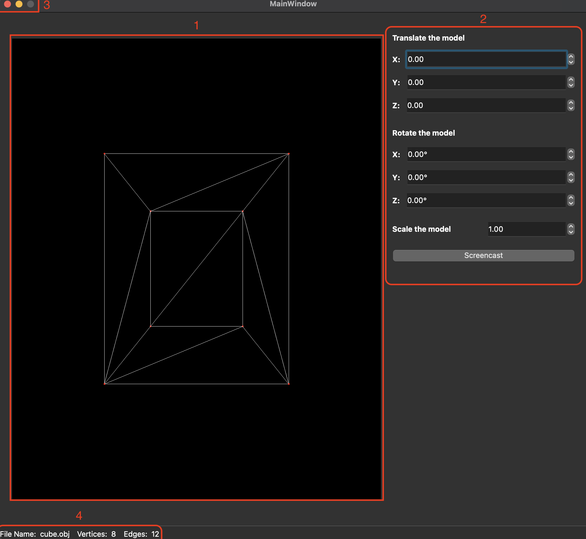
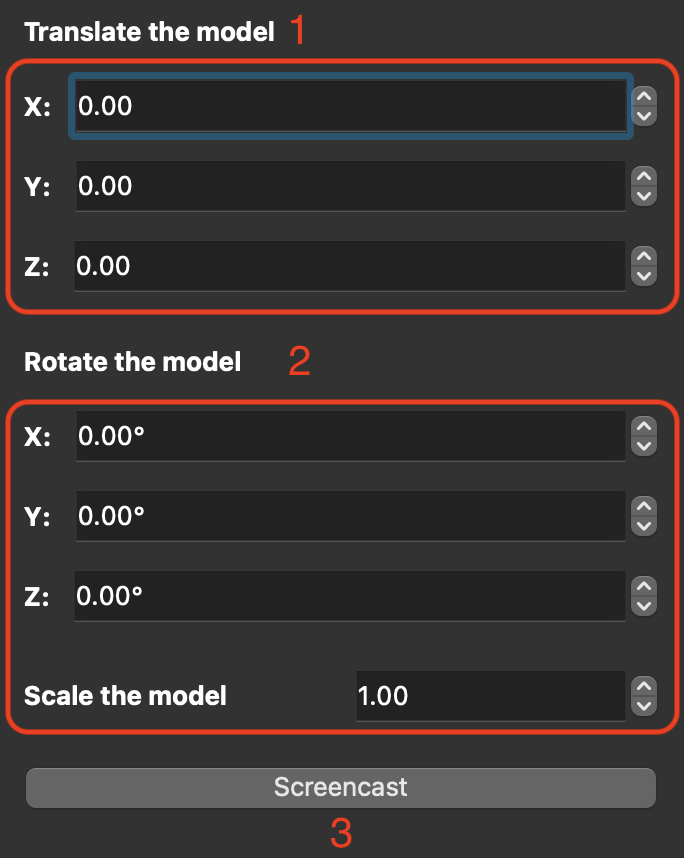

# Interface

Весь интерфейс вьювера можно разделить на 4 пункта:

### 1 - Окно вывода 3д-объекта
### 2 - Меню трансформаций
### 3 - Стандартные кнопки закрытия/сворачивания
### 4 - Информация об объекте

А так же

### 5 - Верхнее меню

---
## 1. Output window:
В окне отображается отрисовка 3д-объектов выбранных в верхнем меню.
Обьект может менять местоположение и вращаться по всем трём осям с помощью настроек в "2 - Меню трансформаций"

## 2. Transform menu:

### 1 
- Перемещение объекта по осям x, y, z.

### 2 
- Поворот объекта по осям x, y, z. 
### 2.1 
Поле 'scale' - уменьшение или увеличение объекта.

### 3 
- Кнопка Screencast - coming soon... (В следущем обновлении).

## 3. Standart buttons close/hide:

Красная кнопка - закрыть приложение.

Жёлтая кнопка - спрятать приложение.

## 4. Info window:

### Нижняя строка с информацией содержит в себе:
- Название объекта, который отображается в данный момент времени.
- Кол-во вершин у этого объекта
- кол-во полигонов у этого объекта

## 5. Top menu:

### Поле "File" - открывает выпадающий список с выбором действий.

### Поле "Settings" - coming soon... (В следущем обновлении).
---
# Open models

Как открыть файл:

1. Нажать на кнопку File в "5: Top Menu".
2. Выбрать открытие файла.
3. Выбрать .obj файл.
4. Нажать "Открыть".
5. Profit!
---
# Files in project

Весь проект лежит в папке "src->3DViewer_v1.0_SourceCode" на ветке "develop".

parser.c - Парсинг .obj файлов.

affine_transformation.c - Афинные преобразования, нужные для "2. Transform menu".

3d_viewer.h - хедер для всех C-файлов.

все файлы .cpp - отрисовка графики.

# Make

- Цель "all" - Билдит проект.

- Цель "build" - Билдит проект.

- Цель "rebuild" - Всё отчищает и билдит проект снова.

- Цель "install" - Устанавливает 3D_Viewer.

- Цель "uninstall" - Удаляет 3D_Viewer.

- Цель "dvi" - открывает man, который вы сейчас читаете.

- Цель "dist" - Архивирует проект в .tar

- Цель "tests" - Запускает тесты.

- Цель "3d_viewer.a" - Создаёт статическую библиотеку

- Цель "gcov_report" - Создаёт html-страницу покрытия кода unit-тестами

- Цель "check" - Проверка кода на стиль.

- Цель "clean" - отчищает всё.